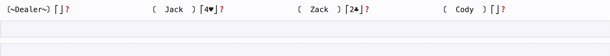

# blackjack-simulator

A simple, pure python simulator for the card game blackjack.

You can simulate a game by first initializing the players along with the dealer.
```python
from blackjack import Player, Dealer, Table, Game, DealerStrat

jack = Player(strategy = DealerStrat(max_hit_value=18), name='Jack')
zack = Player(strategy = DealerStrat(max_hit_value=17), name='Zack')
cody = Player(strategy = DealerStrat(max_hit_value=16), name='Cody')

dealer=Dealer(strategy = DealerStrat(max_hit_value=16))
```

The `DealerStrat` is a simple strategy that most casino dealers are directed to follow: you must hit if you are below a certain threshold, otherwise stay.

Now, we the players sit around a table and start the game.

```python
big_table = Table(dealer, players=[jack,zack,cody])

game = Game(table=big_table)
game.simulate_rounds(1, verbose=True, delay=1)
```


You can access a summary of the game.
```python
game.summary()
```
